# Documentation

We used OOP paradigm to make a library which is imported below using `#include"Coursework1/Coursework1lib.h"`.

## Class Diagram


## Library Dependencies: 

###  - CSVReader.hpp 
This File contains the `CSVReader` class whith with its helper methods and attributes that to read given datasets

#### `CSVReader` Constructor Arguments:
* `input_file_name` takes the path to the csv file as a string

#### `CSVReader` Attributes: 
* `n_cols` represent number of columns in the dataset
* `col_names` represent the names of columns

#### `CSVReader` Methods: 
* `splitcomma()` converts a string to a vector of strings by splitting at commas.
* `count_cols()` used to get the number of columns in the file.

<hr>

###  - Matrix.hpp
This File contains the `Matrix` class whith with its helper methods and attributes that are used mainly to  solve both part 1 and part 2

#### `Matrix` Constructor Arguments:
* `in_mat` a vector of vectors of doubles

#### `Matrix` Attributes:
* `dim` an integer denoting the matrix dimensions

#### `Matrix` Methods: 
* `augment_matrix()` is used to add the coefficient of f(x)/y among the equation.
* `get_row ()` / `get_column()` are used to catch specific rows/columns respectively and make any calculations on them, their inputs are the row and column number respectively.
* `swap_rows()` used to swap rows according to the greatest coefficient for pivoting, its inputs are the rows numbers that needed to be swapped.
* `get_abs_max()` used to get the maximum coefficient in the row, its input is coefficient integer.
* `scale_matrix()` used for scaling as dividing all coefficients in each row by the greatest coefficient in it.
* `matrix_row_operation()` takes a coefficient multiplies it by a given row and adds the result to a second row.
* `row_echelon_form()` helps to establish a lower triangular matrix.
* `flag_singular()` / `flag_ill_conditioned()` are used to test the condition of the system.
* `flag_diagonally_dominant()` used specifically for Gauss Seidel as it requires that the coefficients in the absolute values on the diagonal of the matrix are larger than the sum of other elements in their rows.

<hr>

### - SolverBase.hpp
This file contains a base class called `SolverBase` that contains all steps that are shared between `SolveGaussElimination` and `SolveSeidle` . This class should be inherited in both solvers as it contains common steps in both solvers.

#### `SolverBase` Attributes:
* `solution` a vector that contains the solution for the system of equations.

#### `SolverBase` Methods: 
* `get_abs_max_index()` returns the index of the absolute maximum element in a vector.
* `find_pivot()` used to choose the pivot row.
* `rearrange_rows()` called recursively to rearrange rows according to find_pivot.
* `print_aug_matrix()` prints the augemented matrix in a formatted manner.
* `convert_to_triangular()` puts the matrix in the upper triangular form.
* `print_solution()` prints the solution to consule in formatted manner.
* `determinant_check()` calculate the determinant value by getting the product of element on the diagonal, then checks if the value != 0.


<hr>

### - SolveSeidle.hpp 
This file contains the SolveSeidle class that implements the Gauss-Seidle method for solving equations.

This class will print a warning when the given matrix is not diagonally dominant, indicating that convergence is not guaranteed. However it will proceed and attempt to find a solution.

This class will only attempt a solution if `flag_singular()` and `flag_ill_conditioned()` are both true.

#### `SolveSeidle` Attributes:
* all of `SolverBase` attributes.
* `n_iterations` an Integer. Number of iterations.

#### `SolveSeidle` Methods: 
* all of `SolverBase` methods.

#### `SolveSeidle` Constructor Arguments:
* `A` a `Matrix` object. This is the matrix of coefficients.
* `b` a vector of doubles. This the y-values.
* `n` an Integer. Number of iterations.
* `verbose` a boolean. if true prints the solution after every iteration. Otherwise prints the solution every fifth iteration.

<hr>

### - SolveGaussElimination.hpp 
This file contains the SolveSeidle class that implements the Gauss-Seidle method for solving equations.

This class will only attempt a solution if `flag_singular()` and `flag_ill_conditioned()` are both true.

#### `SolveGaussElimination` Constructor Arguments:
* `A` a `Matrix` object. This is the matrix of coefficients.
* `b` a vector of doubles. This the y-values.
* `verbose` a boolean. if true prints the steps of Gauss Elimination methods for the problem being solbed

#### `SolveGaussElimination` Attributes:
* all of `SolverBase` attributes.

#### `SolveGaussElimination` Methods: 
* all of `SolverBase` methods.

<hr>

### - RegressionBase.hpp 
This File contains the `RegressionBase` base class, containing common steps in `PolynomialRegression` and `MultipleLinearRegression` like calculation of root mean square error (rmse) so this class should be inherited in both regressors.

#### `RegressionBase` Attributes:
* `polynomial_coeffs` is a vector containing the coefficients obtained after solving the system of equations.
* `m` is the degree of the polynomial in case of using polynomial regression.
* `n` if n is equal to 1 the system of equations will be solved using the Gauss Elimination Method. if n is equal to 2 Gauss Seidle will be used instead. 1 is default.
* `solution` a vector that stores the solution to the equation.

#### `RegressionBase` Methods:
* `sqrt()` calculates the square root of a given double.
* `rmse()` claculates the root main square error given true values of y and predicted ones.

<hr>

### - PolynomialRegression.hpp 
This File contains the `PolynomialRegression` Class. This class fits a polynomial of order `m` to a given dataset and can predict pints based on the calculated polynomial.

#### `PolynomialRegression` Constructor Arguments:
* `m` the order of the polynomial required.

#### `PolynomialRegression` Attributes:
* all of `RegressionBase` attributes.

#### `PolynomialRegression` Methods:
* all of `RegressionBase` methods.
* `row_algorithm_left()` generates each row of $\mathbf{A}$ where $\mathbf{A} \times \mathbf{x} =  \mathbf{b}$ the size of the row is dictated by `m`
* `row_algorithm_right()` generates each row of $\mathbf{b}$ where $\mathbf{A} \times \mathbf{x} =  \mathbf{b}$ the size of the row is dictated by `m`
* `fit()` takes the values of $\mathbf{x}$ and $\mathbf{y}$ of a given dataset, fits a polynomial using the solver specified by the argument `solver`. the argument `verbose` is a bool that controls how much information this function prints to the console.
* `predict()` substitutes values from `start` to `end` for a given step size `step` and returns values of predicted $\mathbf{y}$.

<hr>

### - MultipleLinearRegression.hpp 
This File contains the `MultipleLinearRegression` Class. This class fits a plane to two given vectors of the same size $\mathbf{x_{1}}$ and $\mathbf{x_{2}}$

#### `MultipleLinearRegression` Constructor Arguments:
* `m` the order of the polynomial required.

#### `MultipleLinearRegression` Attributes:
* all of `RegressionBase` attributes.

#### `MultipleLinearRegression` Methods:
* all of `RegressionBase` methods.
* `element_wise_multiplication()` takes two vectors and performs element wise multiplication to produce the returned vector,
* `sum()` returns the sum of a given vector.
* `fit()` takes the values of $\mathbf{x_{1}}$, $\mathbf{x_{2}}$ and $\mathbf{y}$ of a given dataset, fits a plane using the solver specified by the argument `solver`. the argument `verbose` is a bool that controls how much information this function prints to the console.
* `predict()` substitutes values from $\mathbf{x_{1}}$ and $\mathbf{x_{2}}$ and returns values of predicted $\mathbf{y}$.

<hr>

### - CubicSpline.hpp 
This File contains the `band_matrix` and `Spline` classes.

#### `band_matrix` Constructor Arguments:
* `dim` matrix dimension
* `n_u` number of upper band layers
* `n_l` number of lower band layers

#### `band_matrix` Attributes:
* `m_upper` upper band matrix elements
* `m_lower` lower band matrix elements

#### `band_matrix` Methods:
* `resize()` takes matrix dimension and number of upper and lower diagonals and resizes them to fill matrix shape.
* `dim()` return matrix dimension (longest diagonal)
* `operator()` method defined to access matrix elements by A(i,j)
* `num_upper()` given the elements of the upper band as vector of vectors, returns num upper diagonals 
* `num_lower()` given the elements of the lower band as vector of vectors, returns num lower diagonals
* `lu_decompose()` method takes no arguments and performs the decomposition of the matrix instance.
* `l_solve()` solves system Ly=b to get y
* `r_solve()` solves system Rx=y to get x
* `lu_solve()` solves the system of equations using LU decomposition

#### `Spline` Constructor Arguments:
* `x` the original x points observed (independent variable)
* `y` the original y points observed (dependent variable)

#### `Spline` Attributes:
* `m_x` set of x points (independent variable)
* `m_y` set of y points (dependent variable)
* `m_a` 3rd order spline coefficients
* `m_b` 2nd order spline coefficients
* `m_c` 1st order spline coefficients
* `m_b0` used for left extrapolation (values of x smaller than the smallest value given)
* `m_c0` used for left extrapolation (values of x smaller than the smallest value given)
* `m_left` this attribute is used for left boundary handling, it is enumerated type of (bd_type) or boundary type. It can hold first derivate or second derivative and with the value the will be defined in m_left_value.
* `m_right` similar to the above for the rightmost edge. It is assumed that second deriv is 0 for both ends in our case to extrapolate on zero curvature.
* `m_left_value` this is the value of the boundary type specified in m_left.
* `m_right_value` similar to the above for the rightmost edge.
* `m_force_linear_extrapolation` a boolean attribute whether the fitted curve will continue linearly outside given range (extrapolation area)

#### `Spline` Methods:
* `fitSpline()` this method takes the observed original points and calculates the intervals and returns the cubic spline coefficients for all intervals (fitted curve).
* `interpolateSpline()` this method is used to substitute with new values of X to get new values of Y based on the fitted curve.

<hr>

### - NewtonInterpolator.hpp
This File contains the `NewtonInterpolator` class.

#### `NewtonInterpolator` Constructor Arguments:
* `x` set of x points (independent variable)
* `y` set of y points (dependent variable)

#### `NewtonInterpolator` Methods:
* `fit()` this method takes the observed original points and calculates the coefficients of the newton polynomial that fits in all given points.
* `writeNewtonPolynomial()` this method takes the calculated coefficients then writes the newton polynomial to the console.
* `interpolate()` takes the calculated newton polynomial coefficients and a given value x, it substitutes and returns the interpolated value "y".

<hr>

## Plots in this Report
All plots in this report are created using matplotlib-cpp. We created a header file which can be found at `Coursework1/PlottingFunctions.h` in the github repository to pgenerate the plots we need

\pagebreak

# Reportng our work
## Importing the Library


```c++
#include "Coursework1/Coursework1lib.h"
using namespace std;
```

## Part 1 - Solving a System of Linear Equations:
In this section we will test the `SolveGaussElimination` and `SolveSeidle` outlined above on for different examples. Note that Example 1 is the example included in the assignment description.

We included examples that demonstrate the ability of our solvers to solve equaations of variable order. We also included examples that clearly show Guass Seidle limitatins.

Guass Seidle's main criteria for convergence is that the given $\mathbf{A}$ matrix should be diagonally dominant, i.e. the absolute elements on the diagonal of $\mathbf{A}$ must be larger than the sum of all other elements. Otherwise convergence is not guaranteed.

Therefore, although we are aware that we can perform row operations on possibly any given matrix and swap rows/columns to eventually put it in diagonally dominant form, we have chosen not do so in our `SolveSeidle` implementation as this is going to be very computationally expensive. Another reason is that it doesn't make much sense to perform these kind of operations just to use an iterative solver and get an approximated solution when we can use `SolveGaussElimination` to get an exact solution.

### Example 1

$\begin{bmatrix} 2 & 1 & -1 \\ 1 & 4 & 2 \\ -1 & 2 & 7 \end{bmatrix}\times \begin{bmatrix} a_{0} \\ a_{1} \\ a_{2} \end{bmatrix}=   \begin{bmatrix} 0 \\ 14 \\ 30 \end{bmatrix}$


```c++
vector<vector<double>> v ={{2, 1, -1}, {1, 4, 3}, {-1 ,2 ,7}};
Matrix A = Matrix(v);
vector<double> b = {0, 14, 30};
```

#### Solution using Gauss Elimination Method:


```c++
SolveGaussElimination x = SolveGaussElimination(A, b, true);
```

    Matrix Rearranged
                    col 0      col 1      col 2      col 3
    
          Row 0:          2         1        -1         0
    
          Row 1:          1         4         3        14
    
          Row 2:         -1         2         7        30
    
    
    
    Matrix Scaled
                    col 0      col 1      col 2      col 3
    
          Row 0:          1       0.5      -0.5         0
    
          Row 1:       0.25         1      0.75       3.5
    
          Row 2:  -0.142857  0.285714         1   4.28571
    
    
    
    Matrix in Row Echelon Form
                    col 0      col 1      col 2      col 3
    
          Row 0:          1       0.5      -0.5         0
    
          Row 1:          0         1         1         4
    
          Row 2:          0         0         1         5
    
    
    
    The Solution is: 
    (3, -1, 5)


#### Solution using Gauss-Seidle Method:


```c++
SolveSeidle y = SolveSeidle(A, b, 30, false);
```

    iteration 1: 
    (0, 3.5, 3.28571)
    
    
    iteration 6: 
    (2.74616, -0.813117, 4.91034)
    
    
    iteration 11: 
    (2.98782, -0.991033, 4.9957)
    
    
    iteration 16: 
    (2.99942, -0.99957, 4.99979)
    
    
    iteration 21: 
    (2.99997, -0.999979, 4.99999)
    
    
    iteration 26: 
    (3, -0.999999, 5)
    
    
    (3, -1, 5)


### Example 2

$\begin{bmatrix} 2 & -1 & 0 \\ 1 & -3 & 1 \\ -1 & 1 & -3 \end{bmatrix}\times \begin{bmatrix} a_{0} \\ a_{1} \\ a_{2} \end{bmatrix}=   \begin{bmatrix} 2 \\ -2 \\ 6 \end{bmatrix}$


```c++
vector<vector<double>> v ={{2, -1, 0}, {1, -3, 1}, {-1, 1 ,-3}};
Matrix A = Matrix(v);
vector<double> b = {2, -2, 6};
```

#### Solution using Gauss Elimination Method:


```c++
SolveGaussElimination x = SolveGaussElimination(A, b, true);
```

    Matrix Rearranged
                    col 0      col 1      col 2      col 3
    
          Row 0:          2        -1         0         2
    
          Row 1:          1        -3         1        -2
    
          Row 2:         -1         1        -3         6
    
    
    
    Matrix Scaled
                    col 0      col 1      col 2      col 3
    
          Row 0:          1      -0.5         0         1
    
          Row 1:   0.333333        -1  0.333333 -0.666667
    
          Row 2:  -0.333333  0.333333        -1         2
    
    
    
    Matrix in Row Echelon Form
                    col 0      col 1      col 2      col 3
    
          Row 0:          1      -0.5         0         1
    
          Row 1:          0         1      -0.4       1.2
    
          Row 2:          0         0         1  -2.28571
    
    
    
    The Solution is: 
    (1.14286, 0.285714, -2.28571)


#### Solution using Gauss-Seidle Method:


```c++
SolveSeidle y = SolveSeidle(A, b, 31, false);
```

    iteration 2: 
    (1.5, 0.5, -2.33333)
    
    
    iteration 7: 
    (1.14263, 0.285751, -2.28563)
    
    
    iteration 12: 
    (1.14286, 0.285714, -2.28571)
    
    
    iteration 17: 
    (1.14286, 0.285714, -2.28571)
    
    
    iteration 22: 
    (1.14286, 0.285714, -2.28571)
    
    
    iteration 27: 
    (1.14286, 0.285714, -2.28571)
    
    
    (1.14286, 0.285714, -2.28571)


### Example 3

$\begin{bmatrix} 5 & 6 & 7 \\ 6 & 3 & 9 \\ 7 & 9 & 10 \end{bmatrix}\times \begin{bmatrix} a_{0} \\ a_{1} \\ a_{2} \end{bmatrix}=   \begin{bmatrix} 18 \\ 18 \\ 26 \end{bmatrix}$


```c++
vector<vector<double>> v ={{5, 6, 7}, {6, 3, 9}, {7, 9, 10}};
Matrix A = Matrix(v);
vector<double> b = {18, 18, 26};
```

#### Solution using Gauss Elimination Method:


```c++
SolveGaussElimination x = SolveGaussElimination(A, b, true);
```

    Matrix Rearranged
                    col 0      col 1      col 2      col 3
    
          Row 0:          7         9        10        26
    
          Row 1:          5         6         7        18
    
          Row 2:          6         3         9        18
    
    
    
    Matrix Scaled
                    col 0      col 1      col 2      col 3
    
          Row 0:        0.7       0.9         1       2.6
    
          Row 1:   0.714286  0.857143         1   2.57143
    
          Row 2:   0.666667  0.333333         1         2
    
    
    
    Matrix in Row Echelon Form
                    col 0      col 1      col 2      col 3
    
          Row 0:          1   1.28571   1.42857   3.71429
    
          Row 1:          0         1  0.333333   1.33333
    
          Row 2:          0         0         1         1
    
    
    
    The Solution is: 
    (1, 1, 1)


#### Solution using Gauss-Seidle Method:


```c++
SolveSeidle y = SolveSeidle(A, b, 30, false);
```

    This matrix is not in diagonally dominant form. Convergence is not guaranteed!
    iteration 1: 
    (2.57143, 0.857143, 0.888889)
    
    
    iteration 6: 
    (-16.2997, 6.70171, 11.5214)
    
    
    iteration 11: 
    (-58.6386, 17.0658, 36.2927)
    
    
    iteration 16: 
    (-141.786, 36.1943, 85.3481)
    
    
    iteration 21: 
    (-299.796, 71.9214, 178.779)
    
    
    iteration 26: 
    (-597.383, 138.88, 354.851)
    
    
    (-1014.84, 232.685, 601.884)


## Example 4
$\begin{bmatrix} 10 & 2 & -1 & 2 \\ 1 & 5 & 1 & 0 \\ 1 & -2 & -5 & 1 \\ 3 & 0 & 0 & 9 \end{bmatrix}\times \begin{bmatrix} a_{0} \\ a_{1} \\ a_{2} \\ a_{3} \end{bmatrix}=   \begin{bmatrix} -4 \\ 1 \\ 2 \\ 10 \end{bmatrix}$


```c++
vector<vector<double>> v = {{10, 2, -1, 2}, {1, 5, 1, 0}, {1, -2, -5, 1}, {3, 0, 0, 9}};
Matrix A = Matrix(v);
vector<double> b = {-4, 1, 2, 10};
```

#### Solution using Gauss Elimination Method:


```c++
SolveGaussElimination x = SolveGaussElimination(A, b, true);
```

    Matrix Rearranged
                    col 0      col 1      col 2      col 3      col 4
    
          Row 0:         10         2        -1         2        -4
    
          Row 1:          1         5         1         0         1
    
          Row 2:          1        -2        -5         1         2
    
          Row 3:          3         0         0         9        10
    
    
    
    Matrix Scaled
                    col 0      col 1      col 2      col 3      col 4
    
          Row 0:          1       0.2      -0.1       0.2      -0.4
    
          Row 1:        0.2         1       0.2         0       0.2
    
          Row 2:        0.2      -0.4        -1       0.2       0.4
    
          Row 3:   0.333333         0         0         1   1.11111
    
    
    
    Matrix in Row Echelon Form
                    col 0      col 1      col 2      col 3      col 4
    
          Row 0:          1       0.2      -0.1       0.2      -0.4
    
          Row 1:          0         1  0.229167-0.0416667  0.291667
    
          Row 2:          0         0         1 -0.161137 -0.691943
    
          Row 3:          0         0         0         1   1.38272
    
    
    
    The Solution is: 
    (-0.814815, 0.45679, -0.469136, 1.38272)


#### Solution using Gauss-Seidle Method:


```c++
SolveSeidle y = SolveSeidle(A, b, 30, false);
```

    iteration 1: 
    (-0.4, 0.28, -0.592, 1.24444)
    
    
    iteration 6: 
    (-0.814909, 0.456827, -0.469136, 1.38275)
    
    
    iteration 11: 
    (-0.814815, 0.45679, -0.469136, 1.38272)
    
    
    iteration 16: 
    (-0.814815, 0.45679, -0.469136, 1.38272)
    
    
    iteration 21: 
    (-0.814815, 0.45679, -0.469136, 1.38272)
    
    
    iteration 26: 
    (-0.814815, 0.45679, -0.469136, 1.38272)
    
    
    (-0.814815, 0.45679, -0.469136, 1.38272)


## Example 5

$\begin{bmatrix} -1 & 1 & -1 & 1 \\ 1 & 1 & 1 & 1 \\ 8 & 4 & 2 & 1 \\ 27 & 9 & 3 & 1 \end{bmatrix}\times \begin{bmatrix} a_{0} \\ a_{1} \\ a_{2} \\ a_{3} \end{bmatrix}=   \begin{bmatrix} 1 \\ 1 \\ -2 \\ 1 \end{bmatrix}$


```c++
vector<vector<double>> v ={{-1,1,-1,1}, {1, 1, 1, 1}, {8, 4 ,2 ,1}, {27, 9, 3, 1}};
Matrix A = Matrix(v);
vector<double> b = {1, 1, -2, 1};
```

#### Solution using Gauss Elimination Method:


```c++
SolveGaussElimination x = SolveGaussElimination(A, b, true);
```

    Matrix Rearranged
                    col 0      col 1      col 2      col 3      col 4
    
          Row 0:         27         9         3         1         1
    
          Row 1:          8         4         2         1        -2
    
          Row 2:          1         1         1         1         1
    
          Row 3:         -1         1        -1         1         1
    
    
    
    Matrix Scaled
                    col 0      col 1      col 2      col 3      col 4
    
          Row 0:          1  0.333333  0.111111  0.037037  0.037037
    
          Row 1:          1       0.5      0.25     0.125     -0.25
    
          Row 2:          1         1         1         1         1
    
          Row 3:         -1         1        -1         1         1
    
    
    
    Matrix in Row Echelon Form
                    col 0      col 1      col 2      col 3      col 4
    
          Row 0:          1  0.333333  0.111111  0.037037  0.037037
    
          Row 1:          0         1  0.833333  0.527778  -1.72222
    
          Row 2:          0         0         1   1.83333   6.33333
    
          Row 3:          0         0         0         1         4
    
    
    
    The Solution is: 
    (1, -3, -1, 4)


#### Solution using Gauss-Seidle Method:


```c++
SolveSeidle y = SolveSeidle(A, b, 30, false);
```

    This matrix is not in diagonally dominant form. Convergence is not guaranteed!
    iteration 1: 
    (0.037037, 0.175926, -2.21296, -1.35185)
    
    
    iteration 6: 
    (-0.61628, 2.89132, -0.919571, -3.42717)
    
    
    iteration 11: 
    (-0.752839, 3.00523, -0.747436, -3.5055)
    
    
    iteration 16: 
    (-0.750172, 3.00018, -0.749638, -3.49999)
    
    
    iteration 21: 
    (-0.749997, 2.99999, -0.750013, -3.5)
    
    
    iteration 26: 
    (-0.75, 3, -0.75, -3.5)
    
    
    (-0.75, 3, -0.75, -3.5)


\pagebreak
## Part 2 - Regression:

### Reading CSV Files
in this part we will need to read CSV files so we will demonstrate the functionality of the `CSVReader` classs outlined above


```c++
CSVReader csv = CSVReader("datasets/part_2/a/2_a_dataset_1.csv");
```


```c++
csv.n_cols
```


    2


```c++
csv.data
```


    { { 0.0000000, 1.0000000, 2.0000000, 3.0000000, 4.0000000, 5.0000000, 6.0000000, 7.0000000, 8.0000000, 9.0000000 }, { 2.7539933, 1.8948100, 5.6677209, 8.5087095, 10.926519, 13.530086, 11.835347, 17.623997, 21.183804, 23.939619 } }


```c++
csv.col_names
```


    { "x", "y" }


### A. Curve Fitting
below we will demonstrate how our `PlynomialRegression` class fits `2_a_dataset_1.csv` and `2_a_dataset_2.csv` using each solver

We will also need to import our plotting dependencies


```c++
!python3-config --includes
```

    -I/srv/conda/envs/notebook/include/python3.7m -I/srv/conda/envs/notebook/include/python3.7m


```c++
!python3-config --libs
```

    -lpython3.7m -lcrypt -lpthread -ldl  -lutil -lrt -lm 


```c++
#pragma cling add_include_path("/srv/conda/envs/notebook/include/python3.7m")
#pragma cling add_library_path("/srv/conda/envs/notebook/lib")
#pragma cling load("python3.7m")
```


```c++
#define WITHOUT_NUMPY 1
#include "Coursework1/PlottingFunctions.h"

```

#### `2_a_dataset_1.csv` Using `SolveGaussElimination`


```c++
PlynomialRegression P(2);
CSVReader csv = CSVReader("./datasets/part_2/a/2_a_dataset_1.csv");
P.fit(csv.data[0], csv.data[1], 1, true);
vector<double> y = P.predict(0, 10, 0.1);
```

    Matrix Rearranged
                    col 0      col 1      col 2      col 3
    
          Row 0:        285      2025     15333   5198.74
    
          Row 1:         45       285      2025    729.42
    
          Row 2:         10        45       285   117.865
    
    
    
    Matrix Scaled
                    col 0      col 1      col 2      col 3
    
          Row 0:  0.0185874  0.132068         1  0.339056
    
          Row 1:  0.0222222  0.140741         1  0.360207
    
          Row 2:  0.0350877  0.157895         1   0.41356
    
    
    
    Matrix in Row Echelon Form
                    col 0      col 1      col 2      col 3
    
          Row 0:          1   7.10526      53.8   18.2412
    
          Row 1:          0         1      11.4   2.63219
    
          Row 2:          0         0         1 0.0915477
    
    
    
    The Solution is: 
    (2.02889, 1.58855, 0.0915477)


```c++
vector<double> x;
for(double i=0; i<=10; i += 0.1) {
    x.push_back(i);
}

PlotLineScatter Plot(x, y, csv.data[0], csv.data[1], "charts/chart1-1.png");
Plot.gen_plot()
```

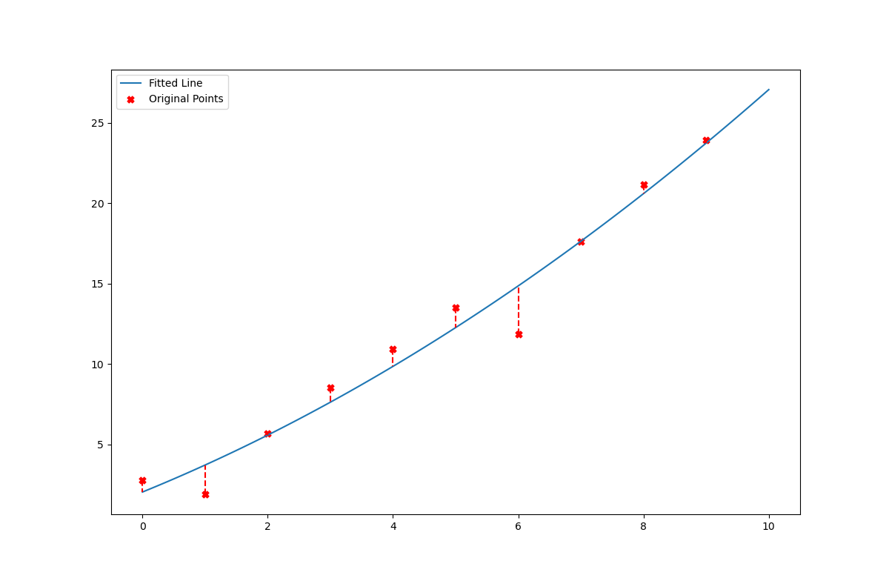


```c++
P.rmse(csv.data[1], y)
```


    3.5188506


#### `2_a_dataset_1.csv` Using `SolveSeidle`


```c++
P.fit(csv.data[0], csv.data[1], 2, false);
vector<double> y = P.predict(0, 10, 0.1);
```

    Please Specify the number of iterations
    30
    This matrix is not in diagonally dominant form. Convergence is not guaranteed!
    iteration 1: 
    (0.41356, 2.49407, 17.8329)
    
    
    iteration 6: 
    (-23096.6, 1120.73, 651.692)
    
    
    iteration 11: 
    (-479624, 25451.3, 12828.5)
    
    
    iteration 16: 
    (-9.4339e+06, 504635, 251353)
    
    
    iteration 21: 
    (-1.85001e+08, 9.90178e+06, 4.92785e+06)
    
    
    iteration 26: 
    (-3.62731e+09, 1.94151e+08, 9.66185e+07)
    
    
    (-3.92201e+10, 2.09925e+09, 1.04468e+09)


```c++
vector<double> x;
for(double i=0; i<=10; i += 0.1) {
    x.push_back(i);
}

PlotLineScatter Plot(x, y, csv.data[0], csv.data[1], "charts/chart1-2.png");
Plot.gen_plot()
```

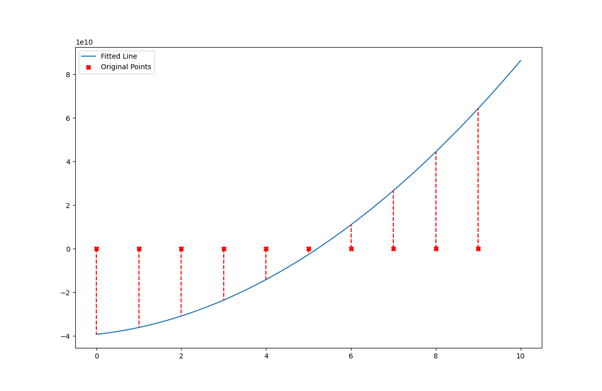


```c++
P.rmse(csv.data[1], y)
```


    8.7206189e+15


\pagebreak

#### `2_a_dataset_2.csv` Using `SolveGaussElimination`


```c++
PlynomialRegression P_2(2);
CSVReader csv_2 = CSVReader("./datasets/part_2/a/2_a_dataset_2.csv");
P_2.fit(csv_2.data[0], csv_2.data[1], 1, true);
vector<double> y = P_2.predict(0, 10, 0.1);
```

    Matrix Rearranged
                    col 0      col 1      col 2      col 3
    
          Row 0:        285      2025     15333   13874.5
    
          Row 1:         45       285      2025   1741.22
    
          Row 2:         10        45       285   224.363
    
    
    
    Matrix Scaled
                    col 0      col 1      col 2      col 3
    
          Row 0:  0.0185874  0.132068         1  0.904878
    
          Row 1:  0.0222222  0.140741         1  0.859861
    
          Row 2:  0.0350877  0.157895         1  0.787238
    
    
    
    Matrix in Row Echelon Form
                    col 0      col 1      col 2      col 3
    
          Row 0:          1   7.10526      53.8   48.6824
    
          Row 1:          0         1      11.4   12.9399
    
          Row 2:          0         0         1   1.69675
    
    
    
    The Solution is: 
    (2.89269, -6.40308, 1.69675)


```c++
vector<double> x;
for(double i=0; i<=10; i += 0.1) {
    x.push_back(i);
}

PlotLineScatter Plot(x, y, csv_2.data[0], csv_2.data[1], "charts/chart2-1.png");
Plot.gen_plot()
```

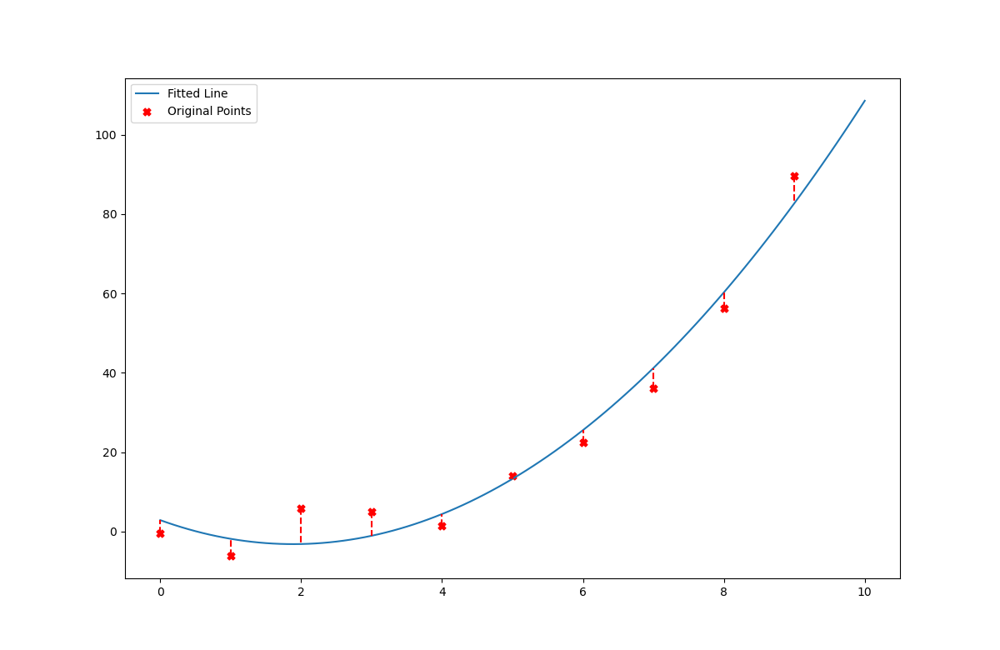


```c++
P_2.rmse(csv_2.data[1], y)
```


    11.680771


#### `2_a_dataset_2.csv` Using `SolveSeidle`


```c++
PlynomialRegression P_2(2);
CSVReader csv_2 = CSVReader("./datasets/part_2/a/2_a_dataset_2.csv");
P_2.fit(csv_2.data[0], csv_2.data[1], 2, false);
vector<double> y = P_2.predict(0, 10, 0.1);

vector<double> x;
for(double i=0; i<=10; i += 0.1) {
    x.push_back(i);
}

PlotLineScatter Plot(x, y, csv_2.data[0], csv_2.data[1], "charts/chart2-2.png");
Plot.gen_plot()
```

    Please Specify the number of iterations
    30
    This matrix is not in diagonally dominant form. Convergence is not guaranteed!
    iteration 1: 
    (0.787238, 5.98524, 47.7098)
    
    
    iteration 6: 
    (-61696.2, 2990.1, 1741.34)
    
    
    iteration 11: 
    (-1.28127e+06, 67984.5, 34271)
    
    
    iteration 16: 
    (-2.52019e+07, 1.34808e+06, 671470)
    
    
    iteration 21: 
    (-4.94215e+08, 2.64518e+07, 1.31643e+07)
    
    
    iteration 26: 
    (-9.69004e+09, 5.18658e+08, 2.58108e+08)
    
    
    (-1.04773e+11, 5.60798e+09, 2.79078e+09)


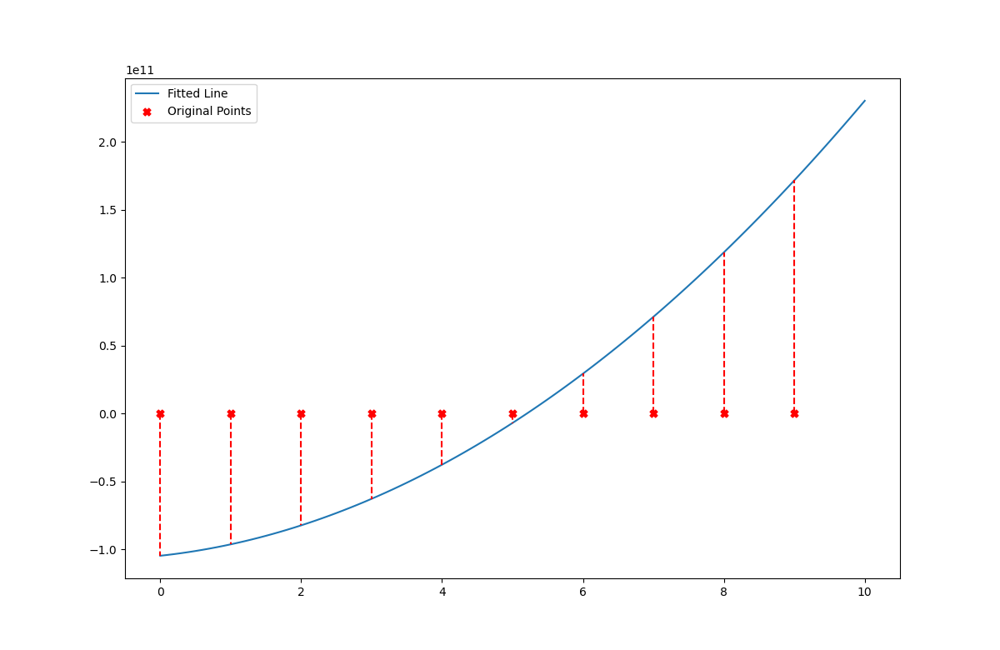


```c++
P_2.rmse(csv_2.data[1], y)
```


    6.2234378e+16


Both the datasets given in this assignment failed to converge using Guass Seidle method during 30 iterations. and that's becuase the system of equations produced from these datasets contained matrices that are non-diagonally dominant.

#### Demonstration of higher order polynomials


```c++
PlynomialRegression P_3(3);
P_3.fit(csv.data[0], csv.data[1], 1, true);
vector<double> y_3_1 = P_3.predict(0, 10, 0.1);

vector<double> x;
for(double i=0; i<=10; i += 0.1) {
    x.push_back(i);
}

PlotLineScatter Plot(x, y_3_1, csv.data[0], csv.data[1], "charts/chart2-3-1.png");
Plot.gen_plot();
```

    Matrix Rearranged
                    col 0      col 1      col 2      col 3      col 4
    
          Row 0:       2025     15333    120825    978405   39567.1
    
          Row 1:        285      2025     15333    120825   5198.74
    
          Row 2:         45       285      2025     15333    729.42
    
          Row 3:         10        45       285      2025   117.865
    
    
    
    Matrix Scaled
                    col 0      col 1      col 2      col 3      col 4
    
          Row 0:  0.0020697 0.0156714  0.123492         1 0.0404404
    
          Row 1: 0.00235878 0.0167598  0.126903         1  0.043027
    
          Row 2: 0.00293485 0.0185874  0.132068         1 0.0475719
    
          Row 3: 0.00493827 0.0222222  0.140741         1 0.0582047
    
    
    
    Matrix in Row Echelon Form
                    col 0      col 1      col 2      col 3      col 4
    
          Row 0:          1   7.57185   59.6667   483.163   19.5393
    
          Row 1:          0         1   12.5735   126.912   2.78211
    
          Row 2:          0-1.63122e-16         1   16.2857  0.127756
    
          Row 3:          0-9.9245e-17         0         1 0.0129977
    
    
    
    The Solution is: 
    (1.70135, 2.18774, -0.0839212, 0.0129977)


##### Fitting `2_a_dataset_1.csv` with a 3rd degree polynomial

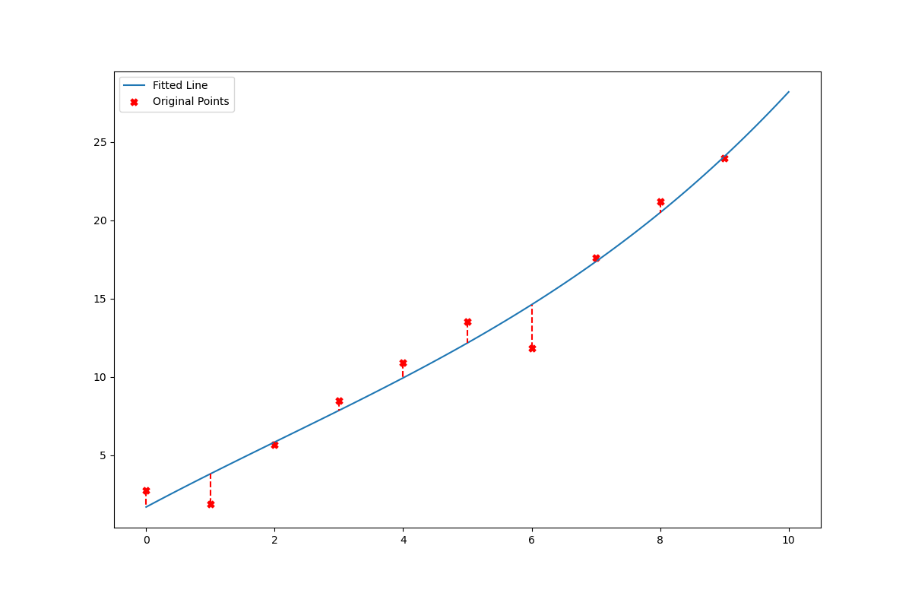


```c++
P_3.fit(csv_2.data[0], csv_2.data[1], 1, false);
vector<double> y_3_2 = P_3.predict(0, 10, 0.1);

vector<double> x;
for(double i=0; i<=10; i += 0.1) {
    x.push_back(i);
}

PlotLineScatter Plot(x, y_3_2, csv_2.data[0], csv_2.data[1], "charts/chart2-3-2.png");
Plot.gen_plot();
```

##### Fitting `2_a_dataset_2.csv` with a 3rd degree polynomial

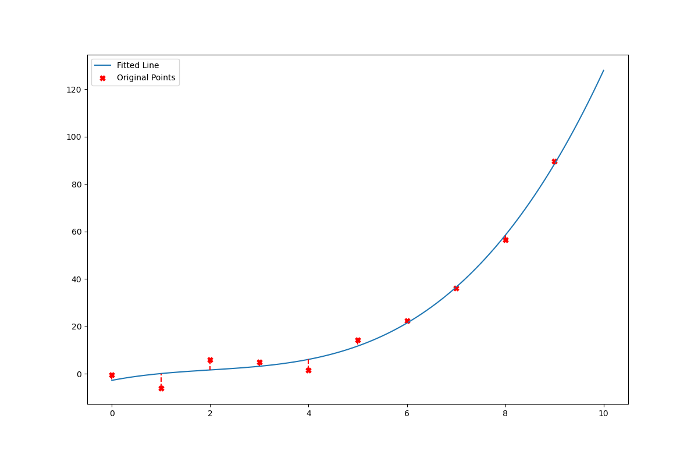


```c++
PlynomialRegression P_4(4);
P_4.fit(csv.data[0], csv.data[1], 1, true);
vector<double> y_4_1 = P_4.predict(0, 10, 0.1);

vector<double> x;
for(double i=0; i<=10; i += 0.1) {
    x.push_back(i);
}

PlotLineScatter Plot(x, y_3_1, csv.data[0], csv.data[1], "charts/chart2-4-1.png");
Plot.gen_plot();
```

    Matrix Rearranged
                    col 0      col 1      col 2      col 3      col 4      col 5
    
          Row 0:      15333    120825    9784058.08042e+066.77313e+07    313526
    
          Row 1:       2025     15333    120825    9784058.08042e+06   39567.1
    
          Row 2:        285      2025     15333    120825    978405   5198.74
    
          Row 3:         45       285      2025     15333    120825    729.42
    
          Row 4:         10        45       285      2025     15333   117.865
    
    
    
    Matrix Scaled
                    col 0      col 1      col 2      col 3      col 4      col 5
    
          Row 0: 0.000226380.00178389 0.0144454  0.119301         10.00462896
    
          Row 1: 0.0002506060.00189755 0.0149528  0.121083         10.00489666
    
          Row 2: 0.00029129 0.0020697 0.0156714  0.123492         10.00531349
    
          Row 3: 0.0003724390.00235878 0.0167598  0.126903         1  0.006037
    
          Row 4: 0.0006521880.00293485 0.0185874  0.132068         10.00768699
    
    
    
    Matrix in Row Echelon Form
                    col 0      col 1      col 2      col 3      col 4      col 5
    
          Row 0:          1   7.88006   63.8104   526.996   4417.36   20.4478
    
          Row 1:          0         1   13.4445   142.217   1385.49   2.94759
    
          Row 2:          0-2.28972e-16         1   17.5722   219.301  0.189984
    
          Row 3:          0-3.89937e-16         0         1   21.1111 0.0483727
    
          Row 4:          0-1.62593e-16         0         0         1 0.0113705
    
    
    
    The Solution is: 
    (2.19256, 0.141043, 1.0645, -0.191672, 0.0113705)


##### Fitting `2_a_dataset_1.csv` with a 4th degree polynomial


```c++
P_4.fit(csv_2.data[0], csv_2.data[1], 1, false);
vector<double> y_4_2 = P_4.predict(0, 10, 0.1);

vector<double> x;
for(double i=0; i<=10; i += 0.1) {
    x.push_back(i);
}

PlotLineScatter Plot(x, y_3_2, csv_2.data[0], csv_2.data[1], "charts/chart2-4-2.png");
Plot.gen_plot();
```

##### Fitting `2_a_dataset_2.csv` with a 4th degree polynomial


\pagebreak

### B. Multivariable Linear Regression

We will use our `MultipleLinearRegression` to fit the house pricing dataset.

#### Reading the dataset


```c++
CSVReader csv_3 = CSVReader("./datasets/kaggle_Housing.csv");
```


```c++
csv_3.n_cols
```


    6


```c++
csv_3.col_names = {"price", "lotsize", "bedrooms", "bathrms", "stories", "garagepl"}
```


    { "price", "lotsize", "bedrooms", "bathrms", "stories", "garagepl" }


#### Chosing the best two features based on the RMSE value


```c++
MultipleLinearRegression M;
for (int i=1; i < 6; ++i)
{
    for (int j=i+1; j<6; ++j)
    {
        M.fit(csv_3.data[i], csv_3.data[j],  csv_3.data[0], 1, false);
        vector<double> y = M.predict(csv_3.data[i], csv_3.data[j]);
        double rmse_value = M.rmse(csv_3.data[0], y);
        cout << "using " << csv_3.col_names[i] << " & " << csv_3.col_names[j] << ": the RMSE value is " << rmse_value << endl;
    }
}
```

    using lotsize & bedrooms: the RMSE value is 32610.7
    using lotsize & bathrms: the RMSE value is 28497
    using lotsize & stories: the RMSE value is 30007.9
    using lotsize & garagepl: the RMSE value is 34364.4
    using bedrooms & bathrms: the RMSE value is 35599.3
    using bedrooms & stories: the RMSE value is 39052.6
    using bedrooms & garagepl: the RMSE value is 38002.1
    using bathrms & stories: the RMSE value is 33981.1
    using bathrms & garagepl: the RMSE value is 33296.3
    using stories & garagepl: the RMSE value is 35207.1


Based on the values above we choose *lotsize* & *bathrms* as our two features since they give us the lowest RMSE value.

#### We will fit a plane using *lotsize* & *bathrms* below and plot the residual values


```c++
M.fit(csv_3.data[1], csv_3.data[3],  csv_3.data[0], 1, false);
vector<double> y = M.predict(csv_3.data[1], csv_3.data[3]);
double rmse_value = M.rmse(csv_3.data[0], y);

PlotResiduals Plot(csv_3.data[0], y, "charts/residuals.png");
Plot.gen_plot()
```

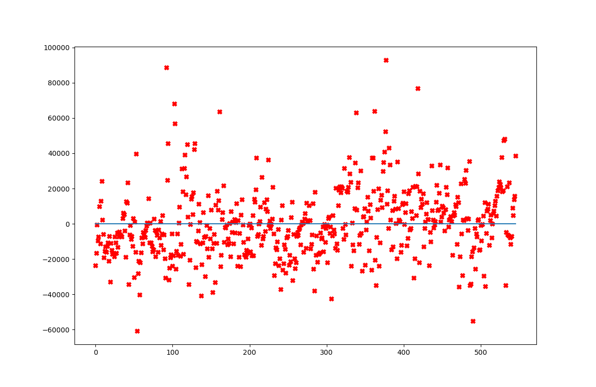

\pagebreak

## Part 3 - Interpolation

### We will start by reading both given datasets


```c++
std::vector<std::pair<std::string, std::vector<double>>> dataset_1 = read_csv("./datasets/part_3/3_dataset_1.csv");
std::vector<std::pair<std::string, std::vector<double>>> dataset_2 = read_csv("./datasets/part_3/3_dataset_2.csv");

vector<double> x1 = dataset_1.at(0).second;
vector<double> y1 = dataset_1.at(1).second;
vector<double> x2 = dataset_2.at(0).second;
vector<double> y2 = dataset_2.at(1).second;
```

### We will fit `NewtonInterpolator` to both datasets below and print the polynomial


```c++
vector<double> x1 = dataset_1.at(0).second;
vector<double> y1 = dataset_1.at(1).second;

NewtonInterpolator Newton;

vector<double> a1 = Newton.fit(x1,y1);
cout << "Newton Interpolation Polynomial: "; Newton.writeNewtonPolynomial(a1);
```

    Newton Interpolation Polynomial: 10+20x^1+1x^2-0.2x^3+1.02969e-13x^4-1.72975e-14x^5-4.80697e-15x^6-5.08368e-17x^7+4.59488e-17x^8+2.53217e-18x^9


```c++
vector<double> a2 = Newton.fit(x2,y2);
cout << "Newton Interpolation Polynomial: "; Newton.writeNewtonPolynomial(a2);
```

    Newton Interpolation Polynomial: 1.10059+0.555967x^1-0.248617x^2-0.243468x^3-0.00947879x^4+0.0356979x^5+0.00708407x^6-0.00222214x^7-0.000773607x^8+4.02274e-05x^9+3.83602e-05x^10+2.01025e-06x^11-9.20882e-07x^12-1.17225e-07x^13+7.73236e-09x^14+2.16861e-09x^15+6.52763e-11x^16-1.25152e-11x^17-1.14218e-12x^18-2.91053e-14x^19


```c++
std::vector<string> colnames(2);
colnames[0] = "Newton Coefficients Dataset 1";
colnames[1] = "Newton Coefficients Dataset 2";
std::vector<vector<double>> coeff(2);
coeff[0] = a1;
coeff[1] = a2;
write_csv("output_csvs/Newton Polynomial Coefficients.csv",colnames,coeff);
```

### We will use `NewtonInterpolator` to double and quadruple the given points in the given data set and plot the results
The resulting pints are given in the `output_csvs` folder

#### Doubling `3_dataset_1.csv` using `NewtonInterpolator`


```c++
vector<double> x1 = dataset_1.at(0).second;
vector<double> y1 = dataset_1.at(1).second;

std::vector<string> colnamesnewp(2);
colnamesnewp[0] = "X";
colnamesnewp[1] = "Y";

vector<vector<double>> newPointsNewton2D1 = getPointsNewton(x1,y1,x1.size(),Newton,a1);
write_csv("output_csvs/Newton 2 Times Dataset1.csv",colnamesnewp,newPointsNewton2D1);

PlotInterpolation Plot(x1, y1, newPointsNewton2D1[0], newPointsNewton2D1[1], "charts/chart2.png");
Plot.gen_plot()
```

    x = -7.35324
    Newton Interpolation: -3.4766
    x = -1.27357
    Newton Interpolation: -13.4363
    x = -5.72844
    Newton Interpolation: -34.158
    x = 2.8193
    Newton Interpolation: 69.8527
    x = 7.57409
    Newton Interpolation: 131.948
    x = -0.144181
    Newton Interpolation: 7.13778
    x = -9.15543
    Newton Interpolation: 64.1983
    x = 0.0469531
    Newton Interpolation: 10.9412
    x = -9.6549
    Newton Interpolation: 90.1196
    x = -8.55566
    Newton Interpolation: 37.3398


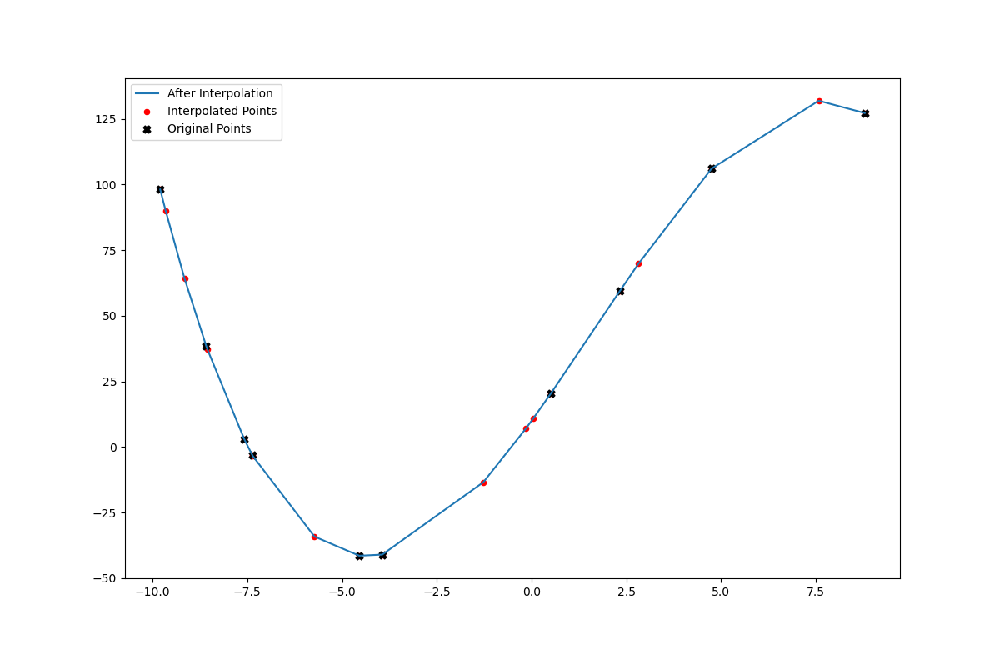

#### Quadrupling `3_dataset_1.csv` using `NewtonInterpolator`


```c++
vector<double> x1 = dataset_1.at(0).second;
vector<double> y1 = dataset_1.at(1).second;
vector<vector<double>> newPointsNewton4D1 = getPointsNewton(x1,y1,x1.size()*3,Newton,a1);
write_csv("output_csvs/Newton 4 Times Dataset1.csv",colnamesnewp,newPointsNewton4D1);

PlotInterpolation Plot(x1, y1, newPointsNewton4D1[0], newPointsNewton4D1[1], "charts/chart3.png");
Plot.gen_plot()
```

    x = -7.35324
    Newton Interpolation: -3.4766
    x = -1.27357
    Newton Interpolation: -13.4363
    x = -5.72844
    Newton Interpolation: -34.158
    x = 2.8193
    Newton Interpolation: 69.8527
    x = 7.57409
    Newton Interpolation: 131.948
    x = -0.144181
    Newton Interpolation: 7.13778
    x = -9.15543
    Newton Interpolation: 64.1983
    x = 0.0469531
    Newton Interpolation: 10.9412
    x = -9.6549
    Newton Interpolation: 90.1196
    x = -8.55566
    Newton Interpolation: 37.3398
    x = 2.96628
    Newton Interpolation: 72.9045
    x = 7.49498
    Newton Interpolation: 131.869
    x = -0.00455605
    Newton Interpolation: 9.9089
    x = 2.35567
    Newton Interpolation: 60.0481
    x = 3.23425
    Newton Interpolation: 78.3791
    x = 4.36813
    Newton Interpolation: 99.7738
    x = -8.91581
    Newton Interpolation: 52.922
    x = -3.69746
    Newton Interpolation: -40.1683
    x = 4.26056
    Newton Interpolation: 97.8957
    x = -3.00785
    Newton Interpolation: -35.6673
    x = 8.46356
    Newton Interpolation: 129.651
    x = 4.20379
    Newton Interpolation: 96.8898
    x = -8.44705
    Newton Interpolation: 32.9556
    x = 6.64506
    Newton Interpolation: 128.373
    x = -1.6869
    Newton Interpolation: -19.9323
    x = -0.918925
    Newton Interpolation: -7.37888
    x = -4.6886
    Newton Interpolation: -41.1752
    x = -6.7033
    Newton Interpolation: -18.8902
    x = 6.88573
    Newton Interpolation: 129.833
    x = -8.67234
    Newton Interpolation: 42.2111


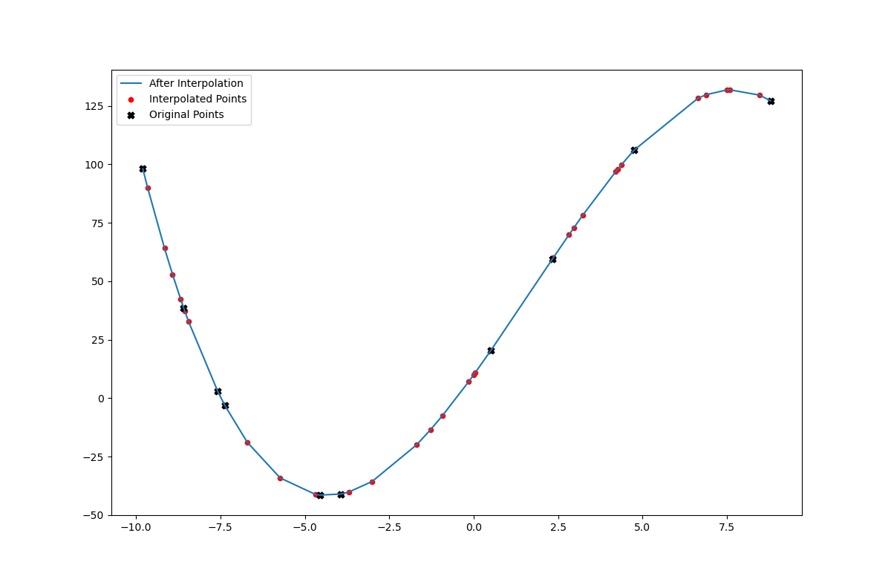

#### Doubling `3_dataset_2.csv` using `NewtonInterpolator`


```c++
vector<double> x2 = dataset_2.at(0).second;
vector<double> y2 = dataset_2.at(1).second;
vector<vector<double>> newPointsNewton2D2 = getPointsNewton(x2,y2,x2.size(),Newton,a2);
write_csv("output_csvs/Newton 2 Times Dataset2.csv",colnamesnewp,newPointsNewton2D2);

PlotInterpolation Plot(x2, y2, newPointsNewton2D2[0], newPointsNewton2D2[1], "charts/chart4.png");
Plot.gen_plot()
```

    x = -7.82099
    Newton Interpolation: 0.01227
    x = -2.40216
    Newton Interpolation: 0.147797
    x = -6.3728
    Newton Interpolation: 0.0240288
    x = 1.24584
    Newton Interpolation: 1.03316
    x = 5.4838
    Newton Interpolation: 0.050436
    x = -1.39553
    Newton Interpolation: 0.341593
    x = -9.42729
    Newton Interpolation: -0.00242728
    x = -1.22517
    Newton Interpolation: 0.403353
    x = -9.87247
    Newton Interpolation: -0.239619
    x = -8.89271
    Newton Interpolation: 0.0243353
    x = 1.37684
    Newton Interpolation: 0.920963
    x = 5.41329
    Newton Interpolation: 0.064648
    x = -1.27108
    Newton Interpolation: 0.38559
    x = 0.832597
    Newton Interpolation: 1.26192
    x = 1.61568
    Newton Interpolation: 0.685382
    x = 2.62631
    Newton Interpolation: -0.0983455
    x = -9.21372
    Newton Interpolation: 0.0468638
    x = -4.56258
    Newton Interpolation: 0.0482861
    x = 2.53044
    Newton Interpolation: -0.0704881
    x = -3.94793
    Newton Interpolation: 0.061169


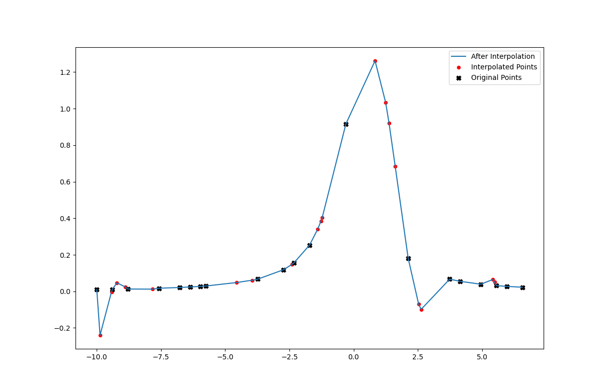

#### Quadrupling `3_dataset_2.csv` using `NewtonInterpolator`


```c++
vector<double> x2 = dataset_2.at(0).second;
vector<double> y2 = dataset_2.at(1).second;
vector<vector<double>> newPointsNewton4D2 = getPointsNewton(x2,y2,x2.size()*3,Newton,a2);
write_csv("output_csvs/Newton 4 Times Dataset2.csv",colnamesnewp,newPointsNewton4D2);

PlotInterpolation Plot(x2, y2, newPointsNewton4D2[0], newPointsNewton4D2[1], "charts/chart5.png");
Plot.gen_plot()
```

    x = -7.82099
    Newton Interpolation: 0.01227
    x = -2.40216
    Newton Interpolation: 0.147797
    x = -6.3728
    Newton Interpolation: 0.0240288
    x = 1.24584
    Newton Interpolation: 1.03316
    x = 5.4838
    Newton Interpolation: 0.050436
    x = -1.39553
    Newton Interpolation: 0.341593
    x = -9.42729
    Newton Interpolation: -0.00242728
    x = -1.22517
    Newton Interpolation: 0.403353
    x = -9.87247
    Newton Interpolation: -0.239619
    x = -8.89271
    Newton Interpolation: 0.0243353
    x = 1.37684
    Newton Interpolation: 0.920963
    x = 5.41329
    Newton Interpolation: 0.064648
    x = -1.27108
    Newton Interpolation: 0.38559
    x = 0.832597
    Newton Interpolation: 1.26192
    x = 1.61568
    Newton Interpolation: 0.685382
    x = 2.62631
    Newton Interpolation: -0.0983455
    x = -9.21372
    Newton Interpolation: 0.0468638
    x = -4.56258
    Newton Interpolation: 0.0482861
    x = 2.53044
    Newton Interpolation: -0.0704881
    x = -3.94793
    Newton Interpolation: 0.061169
    x = 6.27659
    Newton Interpolation: 0.560015
    x = 2.47983
    Newton Interpolation: -0.0508226
    x = -8.79591
    Newton Interpolation: 0.0135965
    x = 4.65575
    Newton Interpolation: 0.00818451
    x = -2.77056
    Newton Interpolation: 0.115192
    x = -2.08606
    Newton Interpolation: 0.186477
    x = -5.44599
    Newton Interpolation: 0.0329312
    x = -7.2417
    Newton Interpolation: 0.0195496
    x = 4.87027
    Newton Interpolation: 0.0270976
    x = -8.99671
    Newton Interpolation: 0.0363538
    x = -1.64225
    Newton Interpolation: 0.270883
    x = -4.71501
    Newton Interpolation: 0.0453435
    x = -1.81695
    Newton Interpolation: 0.232151
    x = -8.49695
    Newton Interpolation: -0.00424079
    x = -8.7783
    Newton Interpolation: 0.0118335
    x = -3.63643
    Newton Interpolation: 0.0699557
    x = 5.13799
    Newton Interpolation: 0.0675253
    x = -2.30615
    Newton Interpolation: 0.158245
    x = -9.17033
    Newton Interpolation: 0.0479083
    x = 2.75894
    Newton Interpolation: -0.11726
    x = -7.92324
    Newton Interpolation: 0.00923891
    x = 1.40471
    Newton Interpolation: 0.895221
    x = 0.4288
    Newton Interpolation: 1.27431
    x = 2.01693
    Newton Interpolation: 0.275353
    x = 4.71978
    Newton Interpolation: 0.0110592
    x = -4.92558
    Newton Interpolation: 0.0413765
    x = -1.49728
    Newton Interpolation: 0.309915
    x = 4.01424
    Newton Interpolation: 0.0682795
    x = 3.94018
    Newton Interpolation: 0.0725632
    x = -3.11872
    Newton Interpolation: 0.0925036
    x = -2.24864
    Newton Interpolation: 0.164998
    x = -7.04588
    Newton Interpolation: 0.0201793
    x = -0.530163
    Newton Interpolation: 0.770173
    x = -9.45244
    Newton Interpolation: -0.0143489
    x = -1.74235
    Newton Interpolation: 0.247679
    x = 2.39596
    Newton Interpolation: -0.0106893
    x = 4.75565
    Newton Interpolation: 0.0137791
    x = 3.94894
    Newton Interpolation: 0.0722156
    x = -6.47563
    Newton Interpolation: 0.0232603
    x = -7.83939
    Newton Interpolation: 0.0117659


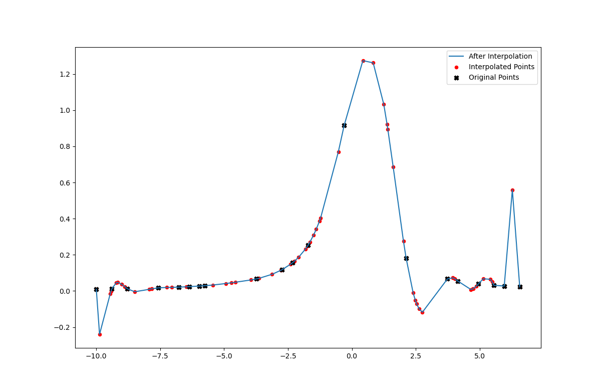

\pagebreak
#### Doubling `3_dataset_1.csv` using `Spline`


```c++
vector<double> x1 = dataset_1.at(0).second;
vector<double> y1 = dataset_1.at(1).second;
Spline s;
vector<vector<double>> cSpline1 = s.fitSpline(x1,y1);

vector<vector<double>> newPointsSpline2D1 = getPointsSpline(x1,y1,x1.size(),s);
write_csv("output_csvs/Spline 2 Times Dataset1.csv",colnamesnewp,newPointsSpline2D1);

PlotInterpolation Plot(x1, y1, newPointsSpline2D1[0], newPointsSpline2D1[1], "charts/chart6.png");
Plot.gen_plot()
```

    x = -7.35324
    Cubic Spline Interpolation: -3.47768
    x = -1.27357
    Cubic Spline Interpolation: -13.3258
    x = -5.72844
    Cubic Spline Interpolation: -34.1737
    x = 2.8193
    Cubic Spline Interpolation: 70.1556
    x = 7.57409
    Cubic Spline Interpolation: 125.746
    x = -0.144181
    Cubic Spline Interpolation: 7.21725
    x = -9.15543
    Cubic Spline Interpolation: 65.0448
    x = 0.0469531
    Cubic Spline Interpolation: 11.0029
    x = -9.6549
    Cubic Spline Interpolation: 90.6614
    x = -8.55566
    Cubic Spline Interpolation: 37.3083


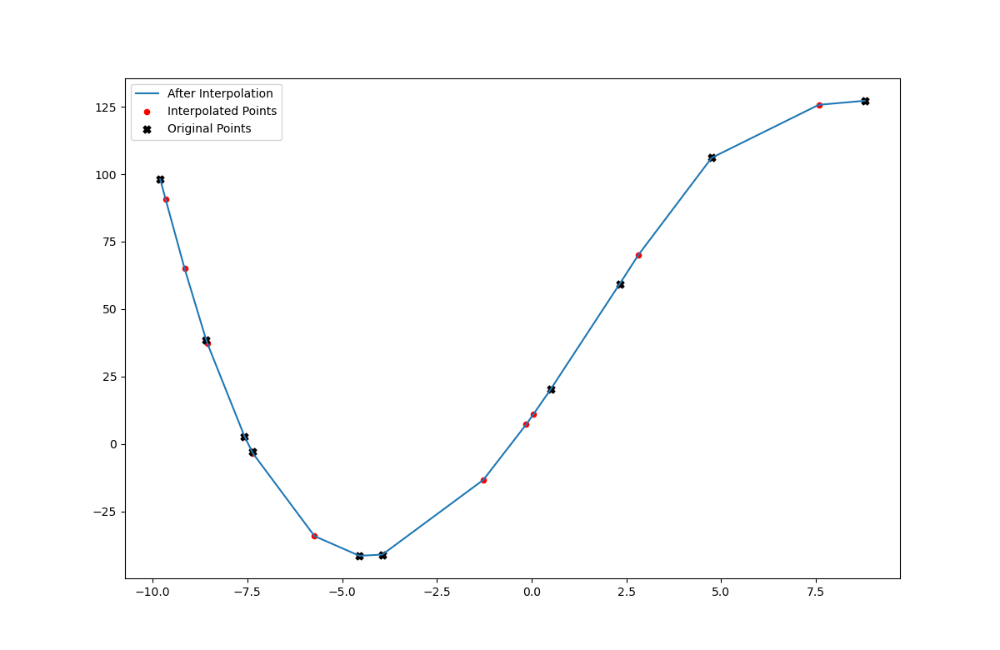

\pagebreak

#### Quadrupling `3_dataset_1.csv` using `Spline`


```c++
vector<double> x1 = dataset_1.at(0).second;
vector<double> y1 = dataset_1.at(1).second;
vector<vector<double>> newPointsSpline4D1 = getPointsSpline(x1,y1,x1.size()*3,s);
write_csv("output_csvs/Spline 4 Times Dataset1.csv",colnamesnewp,newPointsSpline4D1);

PlotInterpolation Plot(x1, y1, newPointsSpline4D1[0], newPointsSpline4D1[1], "charts/chart7.png");
Plot.gen_plot()
```

    x = -7.35324
    Cubic Spline Interpolation: -3.47768
    x = -1.27357
    Cubic Spline Interpolation: -13.3258
    x = -5.72844
    Cubic Spline Interpolation: -34.1737
    x = 2.8193
    Cubic Spline Interpolation: 70.1556
    x = 7.57409
    Cubic Spline Interpolation: 125.746
    x = -0.144181
    Cubic Spline Interpolation: 7.21725
    x = -9.15543
    Cubic Spline Interpolation: 65.0448
    x = 0.0469531
    Cubic Spline Interpolation: 11.0029
    x = -9.6549
    Cubic Spline Interpolation: 90.6614
    x = -8.55566
    Cubic Spline Interpolation: 37.3083
    x = 2.96628
    Cubic Spline Interpolation: 73.3096
    x = 7.49498
    Cubic Spline Interpolation: 125.579
    x = -0.00455605
    Cubic Spline Interpolation: 9.9758
    x = 2.35567
    Cubic Spline Interpolation: 60.0636
    x = 3.23425
    Cubic Spline Interpolation: 78.9598
    x = 4.36813
    Cubic Spline Interpolation: 100.322
    x = -8.91581
    Cubic Spline Interpolation: 53.4236
    x = -3.69746
    Cubic Spline Interpolation: -40.1641
    x = 4.26056
    Cubic Spline Interpolation: 98.5371
    x = -3.00785
    Cubic Spline Interpolation: -35.636
    x = 8.46356
    Cubic Spline Interpolation: 126.969
    x = 4.20379
    Cubic Spline Interpolation: 97.5704
    x = -8.44705
    Cubic Spline Interpolation: 32.8396
    x = 6.64506
    Cubic Spline Interpolation: 122.795
    x = -1.6869
    Cubic Spline Interpolation: -19.8334
    x = -0.918925
    Cubic Spline Interpolation: -7.26656
    x = -4.6886
    Cubic Spline Interpolation: -41.1756
    x = -6.7033
    Cubic Spline Interpolation: -18.9111
    x = 6.88573
    Cubic Spline Interpolation: 123.794
    x = -8.67234
    Cubic Spline Interpolation: 42.3205


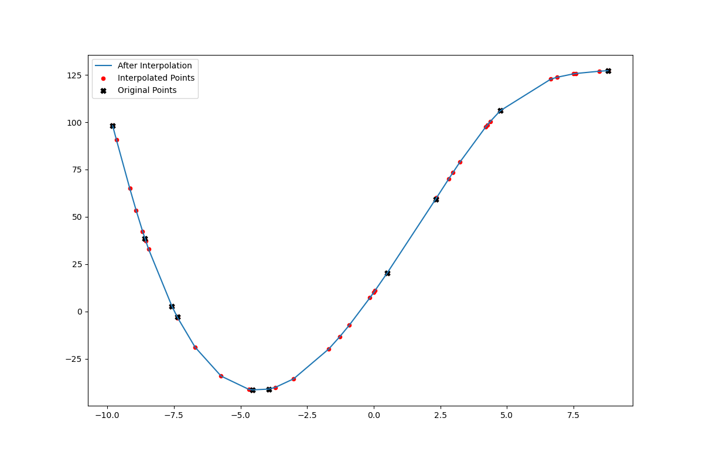

#### Doubling `3_dataset_2.csv` using `Spline`


```c++
vector<double> x2 = dataset_2.at(0).second;
vector<double> y2 = dataset_2.at(1).second;
Spline s2;
vector<vector<double>> cSpline2 = s2.fitSpline(x2,y2);

vector<vector<double>> newPointsSpline2D2 = getPointsSpline(x2,y2,x2.size(),s2);
write_csv("output_csvs/Spline 2 Times Dataset2.csv",colnamesnewp,newPointsSpline2D2);

PlotInterpolation Plot(x2, y2, newPointsSpline2D2[0], newPointsSpline2D2[1], "charts/chart8.png");
Plot.gen_plot()
```

    x = -7.82099
    Cubic Spline Interpolation: 0.0160849
    x = -2.40216
    Cubic Spline Interpolation: 0.148882
    x = -6.3728
    Cubic Spline Interpolation: 0.0240312
    x = 1.24584
    Cubic Spline Interpolation: 0.549258
    x = 5.4838
    Cubic Spline Interpolation: 0.0322147
    x = -1.39553
    Cubic Spline Interpolation: 0.387296
    x = -9.42729
    Cubic Spline Interpolation: 0.0111277
    x = -1.22517
    Cubic Spline Interpolation: 0.477508
    x = -9.87247
    Cubic Spline Interpolation: 0.0101644
    x = -8.89271
    Cubic Spline Interpolation: 0.0124866
    x = 1.37684
    Cubic Spline Interpolation: 0.486327
    x = 5.41329
    Cubic Spline Interpolation: 0.0330678
    x = -1.27108
    Cubic Spline Interpolation: 0.45239
    x = 0.832597
    Cubic Spline Interpolation: 0.739015
    x = 1.61568
    Cubic Spline Interpolation: 0.374616
    x = 2.62631
    Cubic Spline Interpolation: 0.0881143
    x = -9.21372
    Cubic Spline Interpolation: 0.0116398
    x = -4.56258
    Cubic Spline Interpolation: 0.0462939
    x = 2.53044
    Cubic Spline Interpolation: 0.0989651
    x = -3.94793
    Cubic Spline Interpolation: 0.0607052


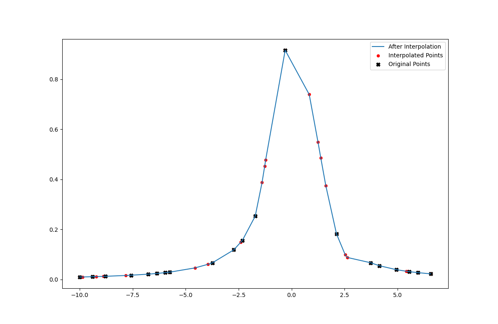

#### Quadrupling `3_dataset_2.csv` using `Spline`


```c++
vector<double> x2 = dataset_2.at(0).second;
vector<double> y2 = dataset_2.at(1).second;
vector<vector<double>> newPointsSpline4D2 = getPointsSpline(x2,y2,x2.size()*3,s2);
write_csv("output_csvs/Spline 4 Times Dataset2.csv",colnamesnewp,newPointsSpline4D2);

PlotInterpolation Plot(x2, y2, newPointsSpline4D2[0], newPointsSpline4D2[1], "charts/chart9.png");
Plot.gen_plot()
```

    x = -7.82099
    Cubic Spline Interpolation: 0.0160849
    x = -2.40216
    Cubic Spline Interpolation: 0.148882
    x = -6.3728
    Cubic Spline Interpolation: 0.0240312
    x = 1.24584
    Cubic Spline Interpolation: 0.549258
    x = 5.4838
    Cubic Spline Interpolation: 0.0322147
    x = -1.39553
    Cubic Spline Interpolation: 0.387296
    x = -9.42729
    Cubic Spline Interpolation: 0.0111277
    x = -1.22517
    Cubic Spline Interpolation: 0.477508
    x = -9.87247
    Cubic Spline Interpolation: 0.0101644
    x = -8.89271
    Cubic Spline Interpolation: 0.0124866
    x = 1.37684
    Cubic Spline Interpolation: 0.486327
    x = 5.41329
    Cubic Spline Interpolation: 0.0330678
    x = -1.27108
    Cubic Spline Interpolation: 0.45239
    x = 0.832597
    Cubic Spline Interpolation: 0.739015
    x = 1.61568
    Cubic Spline Interpolation: 0.374616
    x = 2.62631
    Cubic Spline Interpolation: 0.0881143
    x = -9.21372
    Cubic Spline Interpolation: 0.0116398
    x = -4.56258
    Cubic Spline Interpolation: 0.0462939
    x = 2.53044
    Cubic Spline Interpolation: 0.0989651
    x = -3.94793
    Cubic Spline Interpolation: 0.0607052
    x = 6.27659
    Cubic Spline Interpolation: 0.0248143
    x = 2.47983
    Cubic Spline Interpolation: 0.10584
    x = -8.79591
    Cubic Spline Interpolation: 0.0127603
    x = 4.65575
    Cubic Spline Interpolation: 0.0434686
    x = -2.77056
    Cubic Spline Interpolation: 0.114925
    x = -2.08606
    Cubic Spline Interpolation: 0.179729
    x = -5.44599
    Cubic Spline Interpolation: 0.0326501
    x = -7.2417
    Cubic Spline Interpolation: 0.0187108
    x = 4.87027
    Cubic Spline Interpolation: 0.0403091
    x = -8.99671
    Cubic Spline Interpolation: 0.0122021
    x = -1.64225
    Cubic Spline Interpolation: 0.278717
    x = -4.71501
    Cubic Spline Interpolation: 0.0434136
    x = -1.81695
    Cubic Spline Interpolation: 0.225788
    x = -8.49695
    Cubic Spline Interpolation: 0.0136614
    x = -8.7783
    Cubic Spline Interpolation: 0.012811
    x = -3.63643
    Cubic Spline Interpolation: 0.0699828
    x = 5.13799
    Cubic Spline Interpolation: 0.0366476
    x = -2.30615
    Cubic Spline Interpolation: 0.157884
    x = -9.17033
    Cubic Spline Interpolation: 0.0117489
    x = 2.75894
    Cubic Spline Interpolation: 0.0772795
    x = -7.92324
    Cubic Spline Interpolation: 0.0156785
    x = 1.40471
    Cubic Spline Interpolation: 0.473001
    x = 0.4288
    Cubic Spline Interpolation: 0.882363
    x = 2.01693
    Cubic Spline Interpolation: 0.214244
    x = 4.71978
    Cubic Spline Interpolation: 0.042473
    x = -4.92558
    Cubic Spline Interpolation: 0.0398277
    x = -1.49728
    Cubic Spline Interpolation: 0.338558
    x = 4.01424
    Cubic Spline Interpolation: 0.0593278
    x = 3.94018
    Cubic Spline Interpolation: 0.061778
    x = -3.11872
    Cubic Spline Interpolation: 0.0916173
    x = -2.24864
    Cubic Spline Interpolation: 0.163144
    x = -7.04588
    Cubic Spline Interpolation: 0.0197446
    x = -0.530163
    Cubic Spline Interpolation: 0.842672
    x = -9.45244
    Cubic Spline Interpolation: 0.01107
    x = -1.74235
    Cubic Spline Interpolation: 0.245642
    x = 2.39596
    Cubic Spline Interpolation: 0.119142
    x = 4.75565
    Cubic Spline Interpolation: 0.0419386
    x = 3.94894
    Cubic Spline Interpolation: 0.0614965
    x = -6.47563
    Cubic Spline Interpolation: 0.0232916
    x = -7.83939
    Cubic Spline Interpolation: 0.0160106


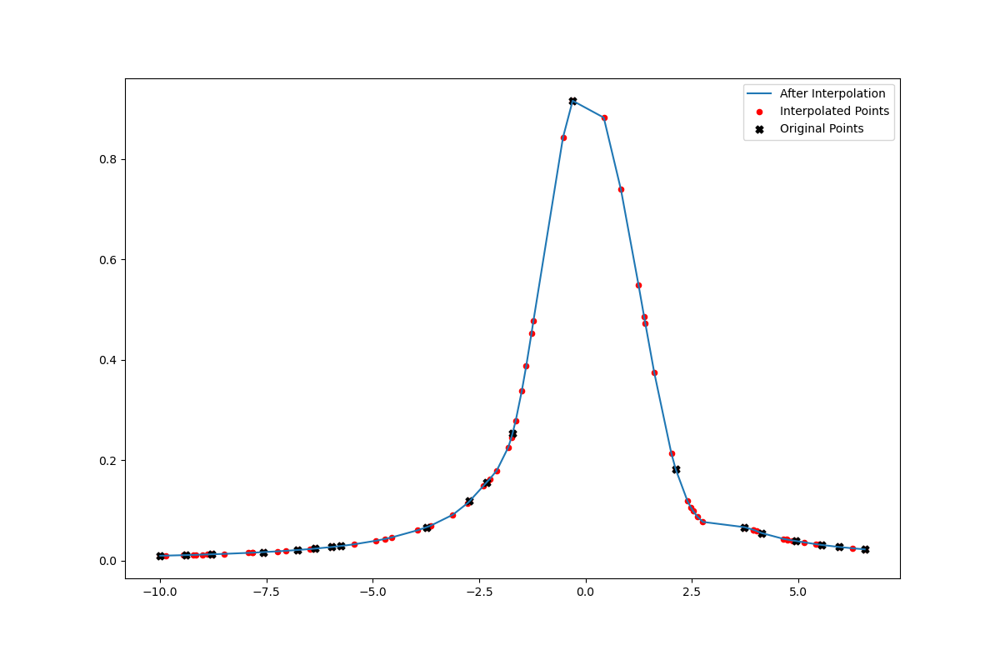

#### Saving results from our implementation of the cubic spline method in CSV format


```c++
vector<double> x1 = dataset_1.at(0).second;
vector<double> y1 = dataset_1.at(1).second;
vector<double> x2 = dataset_2.at(0).second;
vector<double> y2 = dataset_2.at(1).second;

std::vector<string> colnamesSpline1(5);
colnamesSpline1[0] = "Spline x Dataset 1";
colnamesSpline1[1] = "Spline a Dataset 1";
colnamesSpline1[2] = "Spline b Dataset 1";
colnamesSpline1[3] = "Spline c Dataset 1";
colnamesSpline1[4] = "Spline y Dataset 1";

write_csv("output_csvs/Cubic Spline Interpolator Dataset 1.csv",colnamesSpline1,cSpline1);
```


```c++
vector<double> x1 = dataset_1.at(0).second;
vector<double> y1 = dataset_1.at(1).second;
vector<double> x2 = dataset_2.at(0).second;
vector<double> y2 = dataset_2.at(1).second;

vector<vector<double>> cSpline2 = s.fitSpline(x2,y2);
std::vector<string> colnamesSpline2(5);
colnamesSpline2[0] = "Spline x Dataset 2";
colnamesSpline2[1] = "Spline a Dataset 2";
colnamesSpline2[2] = "Spline b Dataset 2";
colnamesSpline2[3] = "Spline c Dataset 2";
colnamesSpline2[4] = "Spline y Dataset 2";

write_csv("output_csvs/Cubic Spline Interpolator Dataset 2.csv",colnamesSpline2,cSpline2);
```

### Our  comment on the difference between Newton's and cubic spline performance on each dataset.

From visually inspecting the plots above we can tell the did fit both datasets better. This is due to the fact that cubic spline is more complex, it gets a more stable solution (less variations in the function after interpolation)
